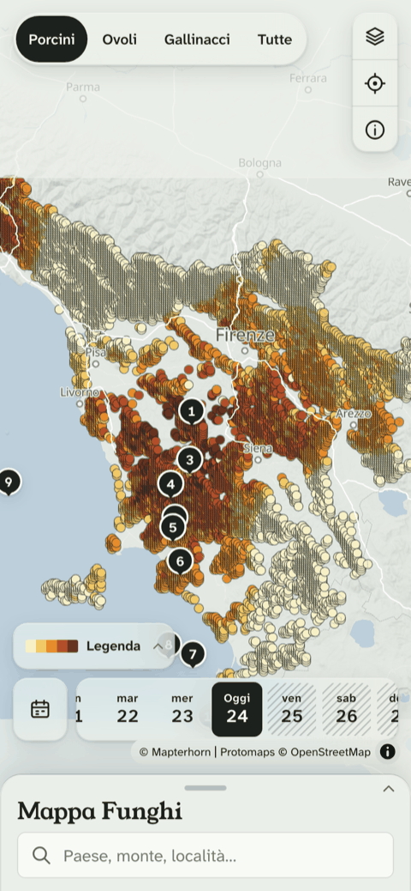
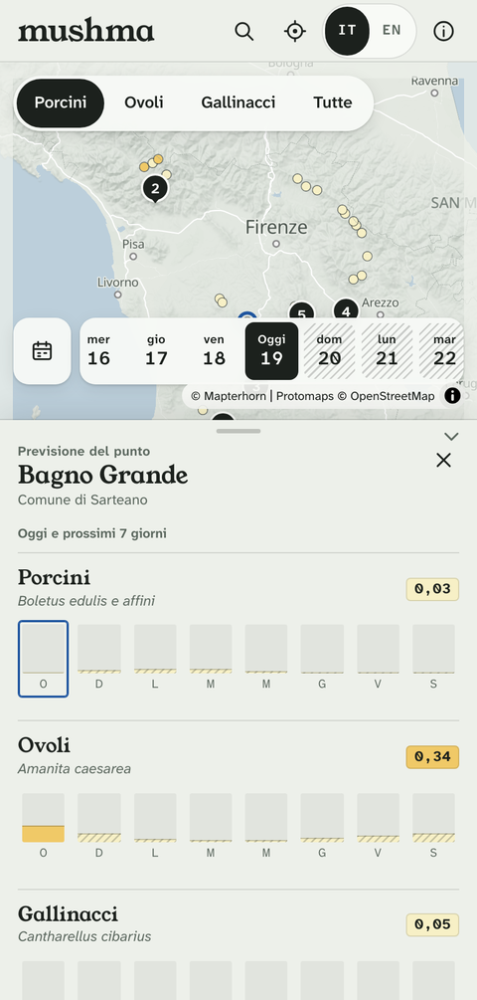

# mushma

Estimates where and when wild edible mushrooms (porcini, ovoli, gallinacci)
are likely to be fruiting in **Tuscany**, from transparent per-species rules
over weather, habitat and terrain, validated against public sightings. Built
for a small group of Tuscan foragers, and as a portfolio piece: the data work
and "why this score" transparency matter as much as the map itself. See
`.gavin-root/PRD.md` for the full product requirements.

mushma never identifies mushrooms or says one is safe to eat — it forecasts
*conditions* only.

| | |
|---|---|
|  |  |

## How it works

Every woodland cell in Tuscany (about 1 km, ~10,800 of them) gets a **0–1
conditions score** per day and species — an index of how favourable the
weather and woodland are, never a probability or an edibility claim. A
species' score is the max over its rule sets (porcini alone has four, one per
sub-species); the combined score shown by default is the max over whichever
species are in season. Every score keeps its full factor breakdown — rain
days ago, cumulative rain, soil/air temperature, drying, habitat, altitude,
season window, sun exposure, slope — so "why this score" is never a black box.
The panel states, for each factor, what was measured (millimetres of rain and
how many days ago, degrees, metres) and the band the rule gives full credit to,
so a suspicious score can be checked on the phone rather than in Parquet.

The rules live in [`api/src/api/config/species/`](api/src/api/config/species/),
one YAML file per species, every threshold and window carrying a cited
source. Weather comes from Open-Meteo (ERA5-Land reanalysis history, ECMWF
IFS forecast), downscaled from a coarse model grid to each cell by elevation.
Reanalysis rain is scaled up with elevation before scoring, because it runs dry
in the hills against Tuscany's rain gauges. Each species carries a growth
clock: warm, humid days after a rain bring the flush forward and cold or dry
ones hold it back, so the rain lag is counted in growth days rather than
calendar days. And every cell's temperatures and drying are shifted by how much
sun its slope and aspect get compared with flat ground.
Habitat, altitude and soil come from a static grid built once from Regione
Toscana, ISPRA, Copernicus and SoilGrids sources (see
[Credits](#credits--sources) below and the app's own Data and credits page).
The daily pipeline (`api.jobs.daily`) re-scores the served window — six days
back to seven days ahead — every morning before 07:00 Europe/Rome.

In the app, that becomes three views:

- **Now.** The conditions map for one species or the combined score, from six
  days ago to a week ahead. Tap a cell, search a place or use GPS for a spot
  forecast: a score per species, seven days of bars and the "why this score"
  breakdown. A floating button centres the map on your position without
  opening a spot. The hot places list ranks clusters of high-scoring cells,
  labelled by comune and nearest named place, with recent public sightings per
  cell.
- **Seasons.** Every stored season for Tuscany or one comune — good days, rain
  and temperature against normal, sightings — compared with each other and
  replayed on the map day by day, plus which species the area's woodland can
  plausibly hold, taxon by taxon.
- **Outlook.** The season so far and ECMWF's long-range tendencies for the
  weeks and months ahead, per area: an outlook, not a forecast.

It is an installable PWA that caches the latest forecast for the woods, shows
when the data was last updated and warns when today's numbers are not in yet,
runs in Italian and English, and credits every source on its own page.

## Validation

The model is backtested against public sightings (GBIF + iNaturalist): is a
sighting's cell-day scored higher than the cell-days it could have been
instead, once the comparison controls for where and when people actually go
looking? Full method, the null check that motivates it, and the baselines the
weather rules have to beat are in
[`.gavin-root/docs/model-v1-validation.md`](.gavin-root/docs/model-v1-validation.md).

Train/hold-out seasons and the backtest method were frozen **before any score
was compared against a sighting** (2016–2023 train, 2024–2025 hold-out,
2026 reported once it ends). Tuning against the train seasons and the final
hold-out numbers are still in progress as of this write-up — that document is
the live source of truth; this section will carry its headline numbers once
they land.

Two findings so far, both written up there. The rain drivers reach full credit
in an ordinary September (one ~30 mm event ten days earlier plus ~80 mm in a
month), so they cannot yet tell a good year from an average one; tuning them
on the train seasons is an open card. And the growth clock with the terrain
factors moves porcini's effort-weighted timing AUC on the train seasons from
0.56 to 0.62, the first porcini interval clear of chance — though with 16–23
sightings per species none of the differences is outside its bootstrap
interval, so they stay on as priors, not results.

## Layout

- `web/` — Vite + React + TypeScript SPA, MapLibre GL, i18n (it/en), PWA.
  Deployed to Vercel.
- `api/` — Python + FastAPI service and the scheduled data pipeline
  (ingest → grid scoring → store). Deployed to a Hetzner server with Docker.
- `deploy/` — the production stack for that server: Docker Compose (API + Caddy), the daily job's
  systemd timer and the server's `.env` template.
- `.gavin-root/docs/` — research and reports (species ecology, sightings
  profile, validation).

## Prerequisites

- [pnpm](https://pnpm.io) (Node version pinned in `.nvmrc`; use
  [nvm](https://github.com/nvm-sh/nvm) or [fnm](https://github.com/Schniz/fnm) to install it)
- [uv](https://docs.astral.sh/uv/) (installs the pinned Python itself)
- [Docker](https://www.docker.com/) if you want to build the `api/` image locally
- [wrangler](https://developers.cloudflare.com/workers/wrangler/) (`pnpm dlx wrangler`) to upload
  the basemap and deploy its tile Worker

## web/

```sh
cd web
pnpm install
cp .env.example .env
pnpm dev             # dev server, http://localhost:5173
pnpm test            # Vitest (unit + components, includes the i18n missing-key check)
pnpm run test:e2e    # Playwright smoke test: map → spot → why (starts the fixture API itself)
pnpm run lint        # ESLint (also rejects hardcoded UI strings)
pnpm run format:check
pnpm run build       # type-check + production build
pnpm run perf        # first-map-paint check on a throttled phone profile (local only)
pnpm run tunnel      # dev server + a public URL for it (see Tunnel below)
```

`.env` points `VITE_API_BASE_URL` at `/api`, which the dev server proxies to
`API_PROXY_TARGET` (default `http://localhost:8000`). Run the API in fixture
mode alongside it (see api/ below).

**Tunnel.** To reach the local stack from outside — the map on a real phone,
or showing work in progress to someone without deploying it:

```sh
cd web && pnpm run tunnel   # needs cloudflared: brew install cloudflared
```

It starts the dev server and a cloudflared quick tunnel together, prints the
public `https://<words>.trycloudflare.com` URL (with a QR code, if you have
`qrencode`), and one Ctrl-C stops both. One tunnel carries the whole stack:
the app and `/api` share its single origin through the proxy above, so there
is no second hostname and no CORS to configure. The script forces
`VITE_API_BASE_URL=/api` for that run, so a local `.env` pointing straight at
`http://localhost:8000` — unreachable from outside — needs no editing. Run the
API alongside it as usual; the script warns if nothing is on `:8000`.

The URL is **public while the tunnel runs**, and a fresh one every run. Anyone
holding it reaches this machine's dev API and whatever is in `api/data/`, so
don't leave it up unattended. `PORT` and `API_PORT` override the defaults.

**App icon.** `web/public/favicon.svg` (a porcino) is the one source of the app
icon; `scripts/render-icons.sh` renders the PWA and home-screen PNGs in
`web/public/icons/` from it. Rerun it after editing the SVG and commit the PNGs.

**Basemap.** The map uses a self-hosted Protomaps extract plus Mapterhorn
hillshade (PRD → Architecture → Basemap). Fetch them once with the
[pmtiles CLI](https://docs.protomaps.com/pmtiles/cli) (`brew install pmtiles`):

```sh
cd web && scripts/extract-basemap.sh   # ~210 MB into the gitignored web/data/basemap/
```

The dev server serves them at `/basemap/`. Without them, leave
`VITE_BASEMAP_URL` and `VITE_TERRAIN_URL` empty and the map draws a plain land
fill. `pnpm run test:e2e` always runs that way.

`.gavin-root/docs/visual-direction.md` has the palette, the score colour scale
and the type choices. `.gavin-root/docs/perf-first-map-paint.md` has the
performance method and results.

`web/src/api/schema.ts` is a TypeScript client generated from `api/openapi.json`
(the API's contract). After changing any `api/` route or response model, run
`uv run python scripts/export_openapi.py` in `api/`, then
`pnpm run generate:api` in `web/`, and commit both. CI fails if either drifts.

## api/

```sh
cd api
uv sync
uv run fastapi dev src/api/main.py   # dev server, http://localhost:8000
uv run pytest
uv run ruff check .
uv run ruff format --check .
```

`GET /health` returns `{"status": "ok"}`.

The routes read the data pipeline's stores under `DATA_DIR` (below): `/scores`, `/spot`,
`/cells/{id}`, `/hotspots`, `/sightings`, and the time views `/comuni`, `/history/seasons`,
`/history/season/{year}`, `/outlook` and `/species` (503 until `api.history.build` has run).
`/status` reports data freshness — the latest scored day, when it was generated and the rules
version — and backs the app's "Updated …" line. Set
`MUSHMA_FIXTURES=1` (see `api/.env.example`) to serve every route from a hand-shaped fixture
dataset instead, with no data at all.

Every factor in a `/spot` or `/cells/{id}` breakdown carries its role, weight, the measured input
with its unit, the lag of the rain it scored, its growth days, and the rule's bands inlined, so
the "why this score" panel quotes the evidence and the quoted band can never drift from the value
beside it.

### Woodland grid

The static 1 km grid (woodland mask, habitat, terrain, soil pH, place labels) is built by a
reproducible script. It downloads every source into `api/data/raw/` once (about 2 GB unpacked,
gitignored) and writes `api/data/grid/tuscany/`: about 10 minutes the first time (SoilGrids is
slow), under 2 minutes after that.

```sh
cd api
uv run python -m api.grid.build --region tuscany
```

Set `DATA_DIR` to build somewhere else (it is `/data` in the production container). Outputs, sources and the woodland
rule are described in `.gavin-root/docs/woodland-grid.md`.

### Weather

Daily weather comes from Open-Meteo: ERA5-Land history and the ECMWF IFS forecast, fetched on a
0.2° lattice of model nodes and downscaled to the woodland cells. Build the point set once the grid
exists, then backfill and update:

```sh
cd api
uv run python -m api.weather.ingest points            # land nodes and cell weights (~130 API calls)
uv run python -m api.weather.ingest backfill --wait   # history from 2016, newest first; ~4 days
uv run python -m api.weather.ingest update            # daily: new reanalysis days + 7-day forecast
uv run python -m api.weather.ingest downscale --start 2026-09-10 --end 2026-09-24
uv run python -m api.weather.checks gauges --start 2025-01-01 --end 2025-12-31   # model rain vs SIR Toscana gauges
uv run python -m api.weather.checks lattice                                      # downscaling leave-out test
```

The backfill stays under the free API limits (it keeps a shared tally in
`api/data/raw/open_meteo/usage.json`), resumes where it stopped, and skips anything already stored.
The first full run (2016–2025, September 2026) took three UTC days of quota; keep the machine awake
while it waits for the next day's budget, since a sleeping laptop stalls the wait, and never run
two at once. Verify a finished backfill by re-running `backfill` without `--wait`: it should fetch
nothing and end with `"done": true`.
Sources, method, checks and the backfill-depth decision are in `.gavin-root/docs/weather-ingest.md`.

### Sightings

Public porcini, ovoli and gallinacci sightings come from GBIF (which already carries research-grade
iNaturalist records) and, for the last two weeks GBIF hasn't caught up with, iNaturalist directly.
They validate the model and back the hotspots list's "recent sightings" signal:

```sh
cd api
uv run python -m api.sightings.ingest resolve-taxa   # check config against each API's taxonomy
uv run python -m api.sightings.ingest fetch          # GBIF history + recent iNaturalist -> store
uv run python -m api.sightings.ingest profile        # counts, licenses, town-proximity bias
```

Only a cell id and species ever land in the store: no sighting's coordinates are kept, so nothing
finer than a 1 km cell can leave it. Method, quality filters and the first pull's profile are in
`.gavin-root/docs/sightings-profile.md`.

### Model

Per-species rules (`api/src/api/config/species/`, one file per species key, every rule with a cited
source) score each woodland cell and day from 0 to 1: a conditions index, not a probability. Groups
(porcini, ovoli, gallinacci) take the max over their keys and `combined` the max over the groups in
season. Every score keeps its factor breakdown.

A score is gates (season, habitat, altitude) × stoppers (frost, snow, heat spike, drying, sun
exposure, slope) × a weighted geometric mean of the weather drivers (rain, temperature, moisture),
so out of season means 0 and heat cannot make up for missing rain.
`api/src/api/config/model.yaml` holds what applies to every species: the group roll-up, the rain
rescale (reanalysis rain × 1.28 + 0.29 per km of elevation, fitted to the SIR Toscana gauges), the
terrain microclimate (each cell's temperatures and ET0 shifted by its clear-sky sun ratio, computed
from slope and aspect in `api.model.terrain`) and the frozen backtest split. Each species file adds
its growth clock: a cardinal-temperature curve on topsoil temperature, slowed by dry air, that
counts the rain lag in growth days instead of calendar days.

```sh
cd api
uv run python -m api.model.pipeline rules                                          # validate and summarise
uv run python -m api.model.pipeline score --start 2026-09-03 --end 2026-09-24      # recent days + forecast
uv run python -m api.model.pipeline score --start 2025-01-01 --end 2025-12-31 --no-factors  # history
```

Scores land in `api/data/scores/tuscany/` (`daily/` for every key, `factors/` for the breakdowns).
A year of every cell took about 25 seconds before the growth clock and about three times that
with it (the daily run scores 14 days, so it adds seconds). How a score is computed is in
`api/src/api/config/species/README.md`; the evidence is in `.gavin-root/docs/species-ecology.md`.

To build and run the production container locally:

```sh
cd api
docker build -t mushma-api .
docker run -p 8000:8000 mushma-api
```

### Time views (history and outlook)

Past seasons, a replayed day or season on the map, and the seasonal outlook (M6) read per-area
tables built from the stores above: weather normals per point, then per comune and for all of
Tuscany the daily good days (score ≥ 0.6), rain and temperature against normal, and sightings
counts. The outlook adds ECMWF's long-range tendencies (EC46 weeks, SEAS5 months) from Open-Meteo's
Seasonal Forecast API.

```sh
cd api
# Once the backfill has reached a year, score it (history needs no factors), then build:
uv run python -m api.model.pipeline score --start 2016-01-01 --end 2025-12-31 --no-factors
uv run python -m api.history.build update --years 2016-2026   # normals + per-area tables
uv run python -m api.weather.seasonal fetch                   # long-range tendencies (~450 calls)
uv run python -m api.history.build outlook                    # ...averaged over the areas
```

Tables land in `api/data/climatology/`, `api/data/history/` and `api/data/outlook/`. `update`
takes about 5 seconds per year and rebuilds the normals every time, so they follow the backfill.
Scoring needs the normals too: the porcini 30-day rain is scored as a share of the cell's normal, so
build them (`uv run python -m api.history.build normals`) before the first `pipeline score` on a
fresh volume.
Definitions (good day, typical season, normals, the outlook's rain tilt) and the design are in
`.gavin-root/docs/time-views.md`; the thresholds are in `api/src/api/config/history.yaml`.

### Scheduled job

`api/src/api/jobs/daily.py` is the one command the daily systemd timer runs on the server: weather update →
sightings fetch → score today -6 to +7 (the served window, with factors) → this season's history
tables → long-range tendencies → their per-area averages. The long-range fetch comes after the
day's scores, so an outage of the seasonal API never holds back today's map. (No separate
"downscale to cells" step: scoring downscales on the fly from the point-level weather store, so
running the ingest CLI's `downscale` export here would just be unused disk churn.) It runs each
step as its own process in that order and stops at the first failure rather than risk scoring on
top of a half-updated weather store; every step logs one JSON line on start and finish.
Set `ALERT_WEBHOOK_URL` (a Slack/Discord/etc. incoming webhook) to get a one-line POST on failure;
unset, it's a no-op and only the failed systemd unit records it (`systemctl status mushma-daily`). Set `HEARTBEAT_URL` (a
healthchecks.io-style check: a plain GET on success) to catch the case `ALERT_WEBHOOK_URL` can't --
the scheduler never running the job at all; point it at a free healthchecks.io/Cronitor/etc. check
configured to expect a ping roughly once a day, and it pages on a missed one. See Monitoring below.

```sh
cd api
uv run python -m api.jobs.daily
```

Must finish well before 07:00 Europe/Rome (PRD → Constraints → Freshness) — see Deploying below for
how it's scheduled, and check the actual run time after the first few days land.

## CI

GitHub Actions (`.github/workflows/ci.yml`) lints and tests both `web/` and
`api/` on every push and pull request against `main`.

## Deploying

Production is **mappafunghi.app**. Everything runs on free tiers except the API server:

| Piece | Where | Cost |
|---|---|---|
| DNS for `mappafunghi.app` (registered at Namecheap) | Cloudflare, Free plan | €0 |
| `web/` at `mappafunghi.app` (`www` redirects to it) | Vercel, Hobby | €0 |
| Basemap tiles at `tiles.mappafunghi.app` | Cloudflare R2 + the Protomaps Worker | €0 (free tier) |
| `api/` and the daily job at `api.mappafunghi.app` | Hetzner CX23 `mushma-prod-01`, Falkenstein | ~€7.31/month incl. VAT |

Fly.io, which M1 chose, was dropped at deploy time: a Fly volume attaches to one machine only, so
the scheduled job machine could never share its stores with the API machine.

**web/ → Vercel.** The `mushma` project builds `web/` (Root Directory `web`, settings in
`web/vercel.json`) on every push to `main`; pull requests get preview deployments. Its environment
variables (Production and Preview):

- `VITE_API_BASE_URL=https://api.mappafunghi.app`
- `VITE_BASEMAP_URL=https://tiles.mappafunghi.app/tuscany.json`
- `VITE_TERRAIN_URL=https://tiles.mappafunghi.app/tuscany-terrain.json`

They are baked in at build time, so changing one needs a redeploy. `mappafunghi.app` and
`www.mappafunghi.app` are CNAMEs to Vercel on Cloudflare, "DNS only" (not proxied).

**Basemap → R2 + Worker.** The two extracts from `web/scripts/extract-basemap.sh` live in the R2
bucket `mushma-tiles`; the [Protomaps Cloudflare Worker](https://docs.protomaps.com/deploy/cloudflare)
(`serverless/cloudflare` in `protomaps/PMTiles`, deployed as `mushma-tiles`) serves them as TileJSON
and z/x/y tiles on the custom domain `tiles.mappafunghi.app`, where Cloudflare's edge caches them
(it doesn't on `workers.dev`). Its `wrangler.toml`: `bucket_name = "mushma-tiles"`,
`PUBLIC_HOSTNAME = "tiles.mappafunghi.app"`, `ALLOWED_ORIGINS` the production origins plus
`localhost:5173`/`4173`, and a `custom_domain` route for the hostname. To refresh the basemap:

```sh
cd web && scripts/extract-basemap.sh
pnpm dlx wrangler r2 object put mushma-tiles/tuscany.pmtiles --file data/basemap/tuscany.pmtiles --remote
pnpm dlx wrangler r2 object put mushma-tiles/tuscany-terrain.pmtiles --file data/basemap/tuscany-terrain.pmtiles --remote
```

Tiles stay cached for a day (`CACHE_CONTROL`) and in the PWA's own cache for 30.

**api/ → Hetzner.** One Docker CE server runs the API behind Caddy (`deploy/compose.yaml`,
`deploy/Caddyfile`), which gets the `api.mappafunghi.app` certificate itself; that DNS record is
"DNS only" so Let's Encrypt and the rate limiter see the real client. The repo is cloned at
`/opt/mushma`, the stores live in `/srv/mushma-data`, and `deploy/.env` (from
`deploy/.env.example`) sets `CORS_ORIGINS` and the monitoring URLs. The data is copied from a
machine that already has it, not rebuilt: the weather backfill alone takes about four days of API
quota. The raw grid sources are only needed to rebuild the grid, so they stay behind:

```sh
# from the repo root, on a machine with the stores (-L: api/data/ may hold symlinks)
rsync -azL --exclude 'raw/rt_ucs' --exclude 'raw/copernicus_dem' --exclude 'raw/ispra_clc18_iv' \
  --exclude 'raw/soilgrids' --exclude 'raw/sir_toscana' --exclude tmp --exclude backtest \
  --exclude '*.lock' api/data/ root@<server>:/srv/mushma-data/
```

First setup on the server:

```sh
git clone https://github.com/Calfredop/mushma.git /opt/mushma
cd /opt/mushma/deploy && cp .env.example .env    # then edit it
docker compose up -d --build
cp mushma-daily.service mushma-daily.timer /etc/systemd/system/
systemctl daemon-reload && systemctl enable --now mushma-daily.timer
```

The timer runs the daily job at 05:00 Europe/Rome as a one-off container of the API image, then
restarts the API. `journalctl -u mushma-daily` has its JSON step log, `systemctl list-timers
mushma-daily.timer` the next run; `systemctl start mushma-daily` runs it now.

To ship an API change: `cd /opt/mushma && git pull && cd deploy && docker compose up -d --build`.

## Monitoring

Caddy and the API restart on their own (`restart: unless-stopped`) but nothing pages anyone. For
that, point a free external pinger (UptimeRobot, healthchecks.io, Better Uptime, ...) at
`https://api.mappafunghi.app/health`; a forager finding the map down is worse than a human finding
out first. The rest is set in `deploy/.env` on the server, then `docker compose up -d`:

- `ALERT_WEBHOOK_URL`: the daily job posts one line to it if a step fails.
- `HEARTBEAT_URL`: the daily job pings it (a plain GET) once it finishes successfully. Configure
  the check (healthchecks.io or similar) to expect roughly one ping a day -- a missed one means the
  scheduler didn't even run the job, which `ALERT_WEBHOOK_URL` alone can't catch.
- An uptime pinger on `/health` (above): catches the API itself being down between daily job runs.
- `SENTRY_DSN`: error tracking for the API (`api/src/api/main.py`). Unset, Sentry is never
  initialized -- no dependency on it for local dev, CI or fixtures mode. Create a free Sentry
  project and set it to turn it on; sampling is kept low/zero by default to stay well inside the
  free tier.
- Rate limiting: the API is public, GET-only and cookie-less (see the CORS comment in `main.py`),
  so it limits requests per IP (from Caddy's `X-Forwarded-For`) to guard the one small server
  against a runaway client. `/health` and `/status` are exempt so uptime pingers are never
  throttled.

## Credits & sources

mushma uses only public data and open-source software; every source is credited, with its licence,
on the app's own Data and credits page (`/credits`). The full, current list lives in
[`web/src/credits.ts`](web/src/credits.ts) (kept in step with the pipeline's own
[`api/src/api/config/sources.yaml`](api/src/api/config/sources.yaml)) — briefly:

- **Weather:** Open-Meteo, serving Copernicus ERA5-Land reanalysis and ECMWF IFS/EC46/SEAS5
  forecasts.
- **Habitat, terrain, soil:** Regione Toscana land use, ISPRA Corine Land Cover, Copernicus DEM
  GLO-30, SoilGrids (ISRIC).
- **Sightings:** GBIF (which carries research-grade iNaturalist records) and iNaturalist directly,
  shown only as counts per cell (PRD → Sightings privacy).
- **Boundaries and places:** ISTAT.
- **Basemap:** a self-hosted Protomaps (OpenStreetMap) extract with Mapterhorn hillshade; place
  search by Photon (komoot); map rendering by MapLibre GL JS.
